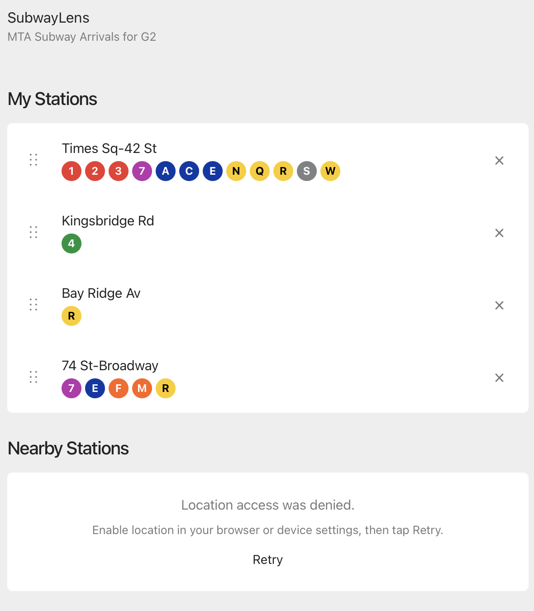
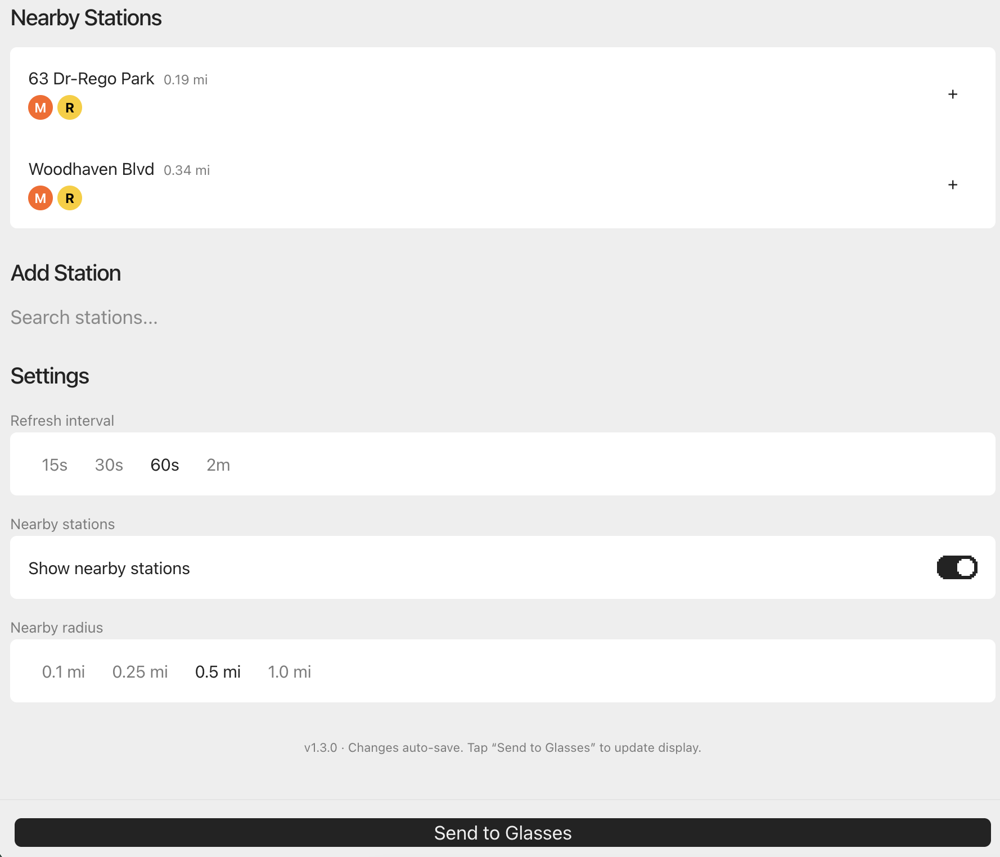

# SubwayLens

Real-time NYC subway arrivals on [Even Realities G2](https://www.evenrealities.com/smart-glasses) smart glasses.

Scroll between your favorite stations with the R1 ring. See the next trains in both directions at a glance. Never miss a train again.

## Screenshots

### Glasses display — real-time arrivals

| Times Sq-42 St | Chambers St |
|---|---|
|  |  |

### Phone settings page

| Favorites + Nearby Stations | Settings + Controls |
|---|---|
|  |  |

## Try it on your G2 glasses

If you have Even Realities G2 glasses, scan this QR code in the Even App (Even Hub section) to load SubwayLens instantly:


Or open this URL in the Even App: **https://subwaylens.vercel.app/**

## What it does

- **Glasses:** Shows real-time subway arrivals for your favorited stations. Scroll between stations, tap to refresh (or view service alerts when active), double-tap to exit.
- **Phone:** Settings page inside the Even App for searching 470+ MTA stations, adding/removing/reordering favorites, viewing GPS-detected nearby stations with distance, and adjusting refresh interval and nearby station detection.
- **Live data:** Fetches MTA GTFS-RT protobuf feeds directly — no backend server, no API key required.
- **Service alerts:** Fetches MTA service alerts alongside arrivals. Affected route badges show `[E!]`. Tap to view alert summaries when alerts are active.
- **No fake data:** When MTA feeds are unreachable, the display shows "No live data" rather than made-up times. You always know what you're seeing is real.

## Why this exists

The NYC subway system has real-time arrival data available via public feeds, but checking your phone while walking, standing on a platform, or holding bags is friction. SubwayLens puts that information in your line of sight — glanceable, hands-free, and always up to date.

This is also a reference implementation for building Even Hub apps that combine a phone settings UI with a glasses display, handle real-time data feeds, and work across the simulator and real hardware.

## Assumptions and constraints

- **Even Realities G2 glasses required** — the app uses the Even Hub SDK to communicate with the glasses via BLE through the Even App on iPhone
- **NYC subway only** — uses MTA GTFS-RT feeds which cover all NYC subway lines (1-7, A-Z, SIR). No bus, LIRR, or Metro-North support yet
- **iPhone only** — the Even App currently runs on iOS; Android support depends on Even Realities
- **No backend** — all processing happens in the WebView. MTA feeds are fetched directly from `api-endpoint.mta.info` (public, no API key since 2023)
- **Station data is bundled** — `stations.json` contains all ~470 MTA subway station complexes with coordinates, routes, and stop IDs. This was generated from MTA GTFS static data and may need updates if the MTA adds or renames stations
- **Display is text-only** — the G2 display is 576x288 green micro-LED with a fixed firmware font. No images, no color, no font control. All UI is built with plain text and Unicode box-drawing characters
- **4-bit greyscale** — 16 shades of green. The "arriving soon" marker (▶) uses brightness to draw attention

## Getting started

### Prerequisites

- Node.js >= 18
- npm >= 9
- For real device testing: Even Realities G2 glasses + Even App (TestFlight beta with Even Hub)

### Install and run

```bash
git clone https://github.com/laolao91/subwaylens.git
cd subwaylens
npm install
npm run dev
```

Open `http://localhost:5173` in your browser to see the settings page. The app detects the Even App bridge automatically — no bridge means you get the settings page for testing.

### Simulator testing

```bash
npx @evenrealities/evenhub-simulator
```

The simulator opens a glasses display window alongside your running dev server. Add favorites via the browser settings page, then tap "Send to Glasses" to sync.

### Real G2 glasses

```bash
npm run dev                    # Start dev server
npm run qr                     # Generate QR code
# Scan QR in Even App → Even Hub section
```

## How it works
1. The Even App loads SubwayLens in a WebView
2. The app initializes the settings page (visible on the phone) AND the glasses display (via the SDK bridge)
3. For each favorited station, it fetches the relevant MTA GTFS-RT protobuf feeds, decodes them, and extracts upcoming arrivals
4. Service alerts are fetched from the MTA alerts feed alongside arrivals — active alerts show as `[E!]` badge indicators
5. The glasses display is rendered as text using two containers: a header (station name + clock) and a body (directions + trains + progress bar + timestamp)
6. Input events from the R1 ring or temple gestures cycle between stations, refresh data, toggle alert summaries, or exit

### Glasses input

| Input | Action |
|-------|--------|
| Scroll down | Next station |
| Scroll up | Previous station |
| Tap (no alerts) | Refresh arrivals |
| Tap (alerts active) | Toggle alert summary view |
| Double-tap | Exit app (confirmation required) |

## Project structure
## Even Hub SDK notes

If you're building your own G2 app, here are the key lessons from this project:

- **Bridge detection:** The SDK injects `EvenAppBridge` in all environments. Check for `window.flutter_inappwebview` to detect the real Even App vs a regular browser.
- **Dual mode:** Always show a settings UI on the phone AND send display data to the glasses. Don't make them mutually exclusive.
- **`borderRdaius` typo:** The G2 SDK uses `borderRdaius` (intentional typo in the SDK). Using the correct spelling `borderRadius` silently fails. Always use `borderRdaius`.
- **Permissions manifest:** Always declare `network` (with whitelist), `location`, or other permissions in `app.json` even if the browser APIs work without them. Even Hub requires explicit permission declarations.
- **`CLICK_EVENT = 0`:** The SDK's `fromJson` normalizes `0` to `undefined`. Always check `eventType === OsEventTypeList.CLICK_EVENT || eventType === undefined`.
- **Scroll events are boundary events:** `SCROLL_TOP_EVENT` and `SCROLL_BOTTOM_EVENT` fire when internal scroll hits the edge, not on every gesture. Use a 300ms cooldown.
- **Touch events in WebView:** HTML5 Drag and Drop doesn't work in mobile WebViews. Use `touchstart`/`touchmove`/`touchend` for drag-to-reorder.
- **MTA feed HEAD requests:** MTA endpoints return 403 for HEAD requests. Use GET with `AbortController` to cancel after headers are received.
- **Protobuf Long objects:** MTA GTFS-RT timestamps decode as protobuf Long objects. Coerce with `Number()` before arithmetic.

## Roadmap

- [x] Smart terminal name abbreviations for the glasses display
- [x] Service alerts and planned work notifications
- [ ] Per-station direction label overrides (match MTA platform signage)
- [ ] LIRR and Metro-North support
- [ ] Per-station line filtering (hide routes you don't ride)
- [ ] Compact view mode
- [ ] Walking time estimates to nearby stations
- [ ] Bus support (separate BusLens app)

## Contributing

Contributions welcome! This is an early-stage project. If you have G2 glasses and want to help:

1. Fork the repo
2. Create a feature branch (`git checkout -b feature/my-feature`)
3. Make your changes
4. Run `npx tsc --noEmit` to verify TypeScript compiles clean
5. Run `npx vite build` to verify the build succeeds
6. Commit with a descriptive message
7. Open a PR

See [CHANGELOG.md](CHANGELOG.md) for version history.

## Versioning

This project follows [Semantic Versioning](https://semver.org/). See [VERSIONING.md](VERSIONING.md) for the full policy.

Current version: **1.5.3**

## License

[GPLv3](https://www.gnu.org/licenses/gpl-3.0.html) — free to use, modify, and distribute. Any modified versions must also be open-sourced under the same license. See [LICENSE](LICENSE) for details.

Copyright (c) 2026 Steven Lao

## Acknowledgments

- [Even Realities](https://www.evenrealities.com/) for the G2 glasses and Even Hub SDK
- [MTA](https://api.mta.info/) for the public GTFS-RT feeds
- [even-toolkit](https://www.npmjs.com/package/even-toolkit) community design system by Fabio
- [gtfs-realtime-bindings](https://www.npmjs.com/package/gtfs-realtime-bindings) for protobuf decoding
