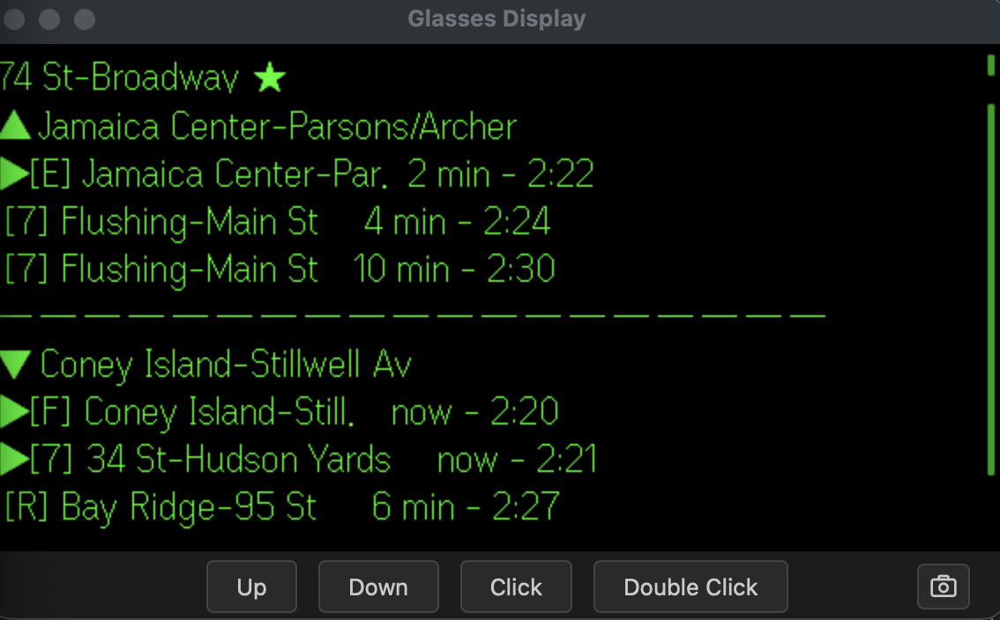
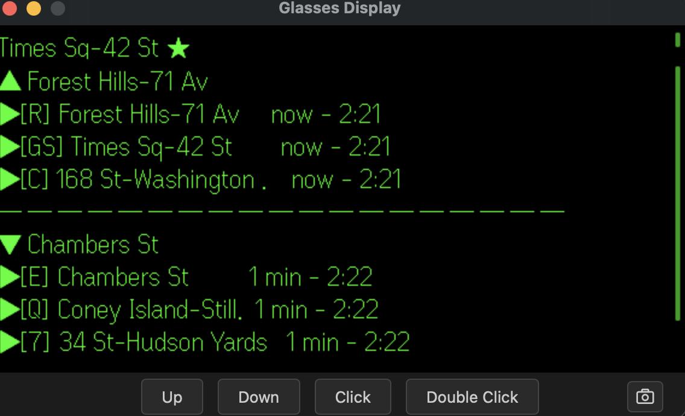
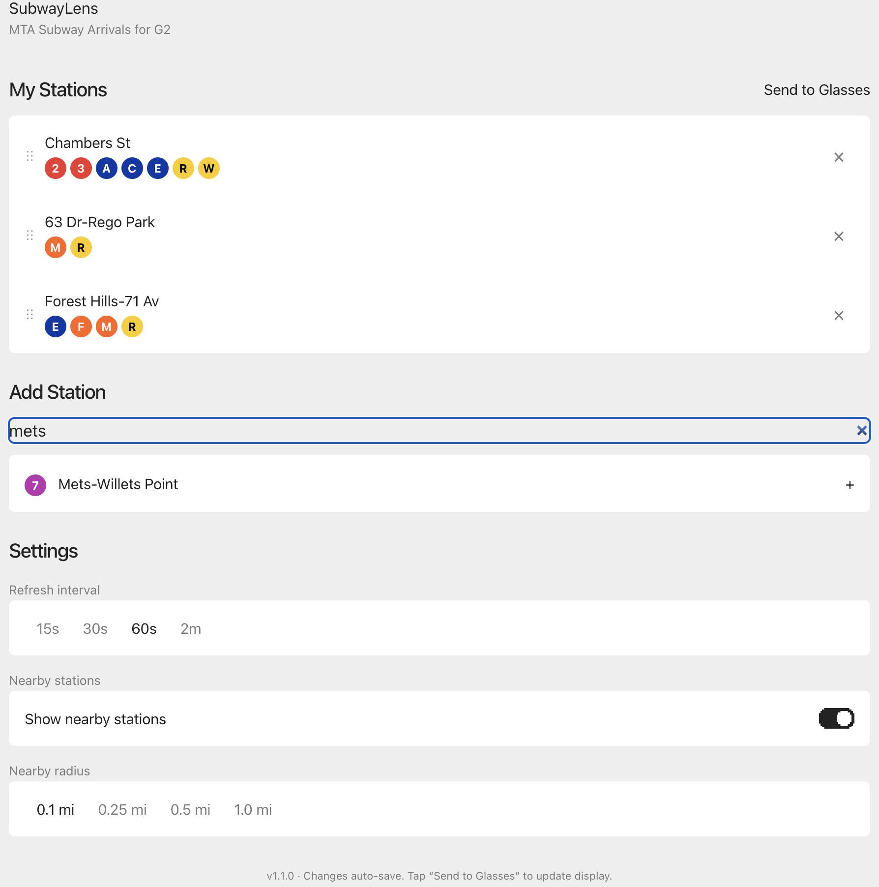

# SubwayLens

Real-time NYC subway arrivals on [Even Realities G2](https://www.evenrealities.com/smart-glasses) smart glasses.

Scroll between your favorite stations with the R1 ring. See the next trains in both directions at a glance. Never miss a train again.

## Screenshots

### Glasses display — real-time arrivals

| 74 St-Broadway (Jackson Heights) | Times Sq-42 St |
|---|---|
|  |  |

### Phone settings page

 

## Try it on your G2 glasses

If you have Even Realities G2 glasses, scan this QR code in the Even App (Even Hub section) to load SubwayLens instantly:


Or open this URL in the Even App: **https://subwaylens.vercel.app/**

## What it does

- **Glasses:** Shows real-time subway arrivals for your favorited stations. Scroll between stations, tap to refresh, double-tap to exit.
- **Phone:** Settings page inside the Even App for searching 470+ MTA stations, adding/removing/reordering favorites, viewing GPS-detected nearby stations with distance, and adjusting refresh interval and nearby station detection.
- **Live data:** Fetches MTA GTFS-RT protobuf feeds directly — no backend server, no API key required.
- **No fake data:** When MTA feeds are unreachable, the display shows "No live data" rather than made-up times. You always know what you're seeing is real.

## Why this exists

The NYC subway system has real-time arrival data available via public feeds, but checking your phone while walking, standing on a platform, or holding bags is friction. SubwayLens puts that information in your line of sight — glanceable, hands-free, and always up to date.

This is also a reference implementation for building Even Hub apps that combine a phone settings UI with a glasses display, handle real-time data feeds, and work across the simulator and real hardware.

## Assumptions and constraints

- **Even Realities G2 glasses required** — the app uses the Even Hub SDK to communicate with the glasses via BLE through the Even App on iPhone
- **NYC subway only** — uses MTA GTFS-RT feeds which cover all NYC subway lines (1-7, A-Z, SIR). No bus, LIRR, or Metro-North support yet
- **iPhone only** — the Even App currently runs on iOS; Android support depends on Even Realities
- **No backend** — all processing happens in the WebView. MTA feeds are fetched directly from `api-endpoint.mta.info` (public, no API key since 2023)
- **Station data is bundled** — `stations.json` contains all ~470 MTA subway station complexes with coordinates, routes, and stop IDs. This was generated from MTA GTFS static data and may need updates if the MTA adds or renames stations
- **Display is text-only** — the G2 display is 576x288 green micro-LED with a fixed firmware font. No images, no color, no font control. All UI is built with plain text and Unicode box-drawing characters
- **4-bit greyscale** — 16 shades of green. The "arriving soon" marker (▶) uses brightness to draw attention

## Getting started

### Prerequisites

- Node.js >= 18
- npm >= 9
- For real device testing: Even Realities G2 glasses + Even App (TestFlight beta with Even Hub)

### Install and run

```bash
git clone https://github.com/YOUR_USERNAME/subwaylens.git
cd subwaylens
npm install
npm run dev
```

Open `http://localhost:5173` in your browser to see the settings page. The app detects the Even App bridge automatically — no bridge means you get the settings page for testing.

### Simulator testing

```bash
# Clone even-dev alongside this project
git clone https://github.com/BxNxM/even-dev.git ../even-dev
cd ../even-dev && npm install

# Register SubwayLens
echo '{"subwaylens": "../subwaylens"}' > apps.json

# Launch
APP_NAME=subwaylens ./start-even.sh
```

The simulator opens a glasses display window and a browser window. Add favorites via the browser console:

```javascript
localStorage.setItem('favorites', JSON.stringify(["263", "616", "611"]))
location.reload()
```

### Real G2 glasses

```bash
npm run dev                    # Start dev server
npm run qr                     # Generate QR code
# Scan QR in Even App → Even Hub section
```

## How it works

```
[MTA GTFS-RT feeds] <--HTTPS--> [iPhone WebView (app logic)] <--BLE--> [G2 Glasses]
```

1. The Even App loads SubwayLens in a WebView
2. The app initializes the settings page (visible on the phone) AND the glasses display (via the SDK bridge)
3. For each favorited station, it fetches the relevant MTA GTFS-RT protobuf feeds, decodes them, and extracts upcoming arrivals
4. The glasses display is rendered as text using two containers: a header (station name) and a body (directions + trains + progress bar)
5. Input events from the R1 ring or temple gestures cycle between stations, refresh data, or exit

### Glasses input

| Input | Action |
|-------|--------|
| Scroll down | Next station |
| Scroll up | Previous station |
| Tap | Refresh arrivals |
| Double-tap | Exit app |

## Project structure

```
subwaylens/
  index.html              Entry point loaded by the Even App WebView
  package.json            Dependencies and npm scripts
  app.json                Even Hub app manifest
  src/
    main.ts               Boot logic, bridge detection, dual-mode routing
    app.css                Even-toolkit light theme + Tailwind + MTA badges
    glasses/
      display.ts           Text rendering for the 576x288 glasses display
      input.ts             SDK event handling with quirk workarounds
      stations.ts          Station list manager (favorites + GPS nearby)
    settings/
      SettingsApp.tsx       React root — data loading, sections, sync, toast
      FavoritesList.tsx     Drag-to-reorder (touch + mouse) + delete
      NearbyStations.tsx    GPS-detected nearby stations with distance
      StationSearch.tsx     Debounced search with route badges
      SettingsPanel.tsx     Refresh interval, nearby toggle, radius
      RouteBadge.tsx        MTA brand color badges
      settings-mount.tsx    Bridges initSettingsPage() to React
      search.ts            Station search with common-name aliases
    data/
      mta-feeds.ts         GTFS-RT protobuf fetch and decode
      feed-urls.ts         MTA feed URL routing per line group
      stations.json        All 470+ NYC subway stations (static data)
    lib/
      types.ts             TypeScript interfaces and defaults
      storage.ts           Bridge localStorage with browser fallback
      time.ts              Arrival time formatting
      geo.ts               GPS distance calculations
```

## Even Hub SDK notes

If you're building your own G2 app, here are the key lessons from this project:

- **Bridge detection:** The SDK injects `EvenAppBridge` in all environments. Check for `window.flutter_inappwebview` to detect the real Even App vs a regular browser.
- **Dual mode:** Always show a settings UI on the phone AND send display data to the glasses. Don't make them mutually exclusive.
- **SDK 0.0.9 update:** Earlier SDK versions used `borderRdaius` (typo). SDK 0.0.9+ corrected this to `borderRadius`. Use the correct spelling for SDK 0.0.9+.
- **Permissions manifest:** Always declare `network` (with whitelist), `location`, or other permissions in `app.json` even if the browser APIs work without them. Even Hub requires explicit permission declarations.
- **`CLICK_EVENT = 0`:** The SDK's `fromJson` normalizes `0` to `undefined`. Always check `eventType === OsEventTypeList.CLICK_EVENT || eventType === undefined`.
- **Scroll events are boundary events:** `SCROLL_TOP_EVENT` and `SCROLL_BOTTOM_EVENT` fire when internal scroll hits the edge, not on every gesture. Use a 300ms cooldown.
- **Touch events in WebView:** HTML5 Drag and Drop doesn't work in mobile WebViews. Use `touchstart`/`touchmove`/`touchend` for drag-to-reorder.

## Roadmap

- [ ] Per-station direction label overrides (match MTA platform signage)
- [ ] Smart terminal name abbreviations for the glasses display
- [ ] LIRR and Metro-North support
- [ ] Bus system support
- [ ] Service alerts and planned work notifications
- [ ] Per-station line filtering (hide routes you don't ride)
- [ ] Compact view mode
- [ ] Walking time estimates to nearby stations

## Contributing

Contributions welcome! This is an early-stage project. If you have G2 glasses and want to help:

1. Fork the repo
2. Create a feature branch (`git checkout -b feature/my-feature`)
3. Make your changes
4. Run `npx tsc --noEmit` to verify TypeScript compiles clean
5. Run `npx vite build` to verify the build succeeds
6. Commit with a descriptive message
7. Open a PR

Please read [tests.md](tests.md) for known issues and [CHANGELOG.md](CHANGELOG.md) for version history.

## Versioning

This project follows [Semantic Versioning](https://semver.org/). See [VERSIONING.md](VERSIONING.md) for the full policy.

Current version: **1.3.0**

## License

[GPLv3](https://www.gnu.org/licenses/gpl-3.0.html) — free to use, modify, and distribute. Any modified versions must also be open-sourced under the same license. See [LICENSE](LICENSE) for details.

Copyright (c) 2026 Steven Lao

## Acknowledgments

- [Even Realities](https://www.evenrealities.com/) for the G2 glasses and Even Hub SDK
- [MTA](https://api.mta.info/) for the public GTFS-RT feeds
- [even-dev](https://github.com/BxNxM/even-dev) simulator by BxNxM
- [gtfs-realtime-bindings](https://www.npmjs.com/package/gtfs-realtime-bindings) for protobuf decoding
